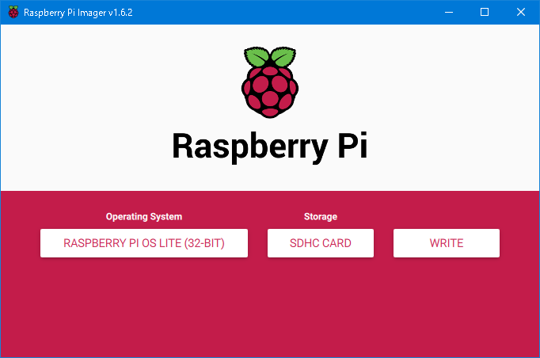

# Linux - はじめに - Raspberry Pi

[Linuxのトップへ](./../index.md)

## Raspberry Piとは

名刺サイズのシングルボードコンピュータ。教育を目的に開発された。

非常に安価であり、電子工作などの用途で使用される。

OSはLinuxを使用し、メジャーなディストリビューションを簡単にインストールできる。

ここではRaspberry PiにRaspbianをインストールし、セキュリティ設定を行った上でインターネットに接続し、他のPCからssh接続して操作できるようにするまでを説明する。

## Raspberry Pi用のOSのインストーラ(Imager)をmicroSDにコピーする

インターネット接続できるWindows 10を使う。

[ここ]からインストーラ(exeファイル)をダウンロードし、実行してImagerをPCにインストールする。

インストールしたらImagerを実行。


このような画面が出たら、インストールするOSと、インストール先のmicroSDカードのドライブを選択する。

OSは、Raspberry Pi OS (other)→Raspberry Pi Lite(32bit)を選択する。

Recommendedの方はデスクトップ機能がついており、それでも問題ないのだが、今回は自動化・サーバ用としてデスクトップ機能のないLiteの方を選択する。



しばらくかかるので、待つ。

終わると、Imagerによって中身が書き換えられたmicroSDがWindowsに認識され、「使用するにはフォーマットが必要です」と出る。無視してmicroSDカードを抜く。

なお、パッケージが壊れるなどでRaspberry Piを完全に初期化したい場合もImagerを使って新しいものを書き直せばよい。

## Raspberry Piの電源を入れる

Raspberry Piにキーボード、マウス、ディスプレイを接続し、Imagerでデータを書き込んだmicroSDカードを挿す。

Raspberry Piは、micro USB(USB-B)で給電すると自動で起動するようになっている（または、スイッチ付きの給電ケーブルを使用する場合、スイッチを入れると起動するようになるので便利）。

## 電源を切る

```sh

shutdown -h now

```

でシャットダウンを指示。緑ランプが消えたら電源を抜く。

-h now を入れないと予約シャットダウンになる。

## raspi-configの実行

```sh 

~ $ sudo raspi-config

```

で各種設定を行うためのraspi-configを実行することができる。

### ロケールの設定

Locale Settingsで

ja_JP.UTF-8 UTF-8 →　en_GB.UTF-8

を選択。

ただし、この時点では日本語フォントがなく、日本語は使用できない。

### キーボードの設定

使用するキーボードによって異なる可能性がある。

1. 5 Localization Options
1. L3 Keyboard
1. model of keyboardは使用しているキーボードのモデルか、無ければGeneric 105-Key(Intl) PC
1. Keyboard LayoutからOtherを選択
1. Japaneseを選択
1. Japanese - Japanese(OADG 109A)を選択
1. The default for the keyboard layoutを選択
1. No compose keyを選択]
1. Finishを選択し終了

## ユーザを作成し、デフォルトユーザの権限を無効にする

デフォルトでは、Raspberry Piは

- ユーザ名:pi
- パスワード:raspberry

というユーザでログインしている。

このユーザのままだと外部から簡単にログインされてしまうため、

- ユーザの新規作成
- 新規作成したユーザに管理者権限を付与する
- 自動ログインを無効にする
- piユーザの権限を無効にする

という操作を行う。

### ユーザの新規作成

```sh

$ sudo adduser (name)

```

で、指定した名前のユーザを新規作成する。

パスワードを2回聞かれるので、このユーザ用のパスワードを新たに決めて入力する。

フルネーム、部屋番号なども聞かれるが、無視して空でEnterキーを押していく。

最後に「以上で正しいですか？」と聞かれるのでYを押して確定する。

### 新規作成したユーザに管理者権限を付与する

```sh

$ sudo gpasswd -a (name) sudo

```

gpasswdはグループの情報を管理するコマンドで、-aまたは-addは指定したユーザへの権限付与を意味する。

### 自動ログインを無効にする

デスクトップ版？　では、自動ログイン設定はetc/lightdmフォルダ下の lightdm.conf というファイルに記載されているとのことだが、執筆時点のRaspblian Liteではlightdmフォルダが存在しなかった。

raspi-configを実行し

1. 1 System Options
1. S5 Boot / Auto Login
1. B1 Console

を選択すると、CUI上でユーザとパスワードの入力が必要となる。

設定すると再起動するか聞かれるので、再起動するか

```sh

~ $ exit

```

でログアウトしてみると、

CUI上でユーザ名とパスワードを聞かれるようになる。

### piユーザの権限を無効にする

```sh

~ $ groups pi

```

で、piユーザの権限を確認できる。

```sh

~ $ gpasswd -d pi adm
~ $ gpasswd -d pi sudo

```

でadm（管理者権限）とsudo権限を削除する。

```sh

~ $ sudo passwd pi

```

でpiユーザのパスワードを変更する。

## Wi-Fiを有効にする

### Raspberry Piのホスト名（コンピュータ名）を変える

1. 1 System Options 
1. S4 Hostname

から変更。

### Wi-Fiの国を設定

Wi-Fi内蔵のRaspberry Piを使用する場合は設定しておいた方が良さそう。

1. 5 Localization Options
1. L4 WLAN Contry
1. JP Japanを選択

### Wi-Fi接続(暫定)

無線LANアクセスポイントの情報を取得するには、

```sh

~ $ sudo iwlist wlan0 scan

```

だが、これだと情報が多すぎて画面に入りきらないので

```sh

~ $ sudo iwlist wlan0 scan | grep ESSID

```

として、ESSIDのみを抽出する。

使用したい無線LANアクセスポイント名があるか確認。


### Wi-Fi接続(パスワードの暗号化)


## 参考ページ

- [[Raspberry Pi] pi ユーザ削除等、なるべく早くユーザー設定でやっておくべきこと](https://www.gadgets-today.net/?p=5148)
- [Raspbian Liteの初期設定 令和2年(2020年)3月版](https://denor.jp/raspbian-lite%E3%81%AE%E5%88%9D%E6%9C%9F%E8%A8%AD%E5%AE%9A-%E4%BB%A4%E5%92%8C2%E5%B9%B42020%E5%B9%B43%E6%9C%88%E7%89%88)
- [RaspberryPiのキーボード入力の日本語化](https://qiita.com/sukinasaki/items/426068d6e87169fa3d88)
- [Raspberry Pi公式 - Setting up a wireless LAN via the command line](https://www.raspberrypi.org/documentation/configuration/wireless/wireless-cli.md)


