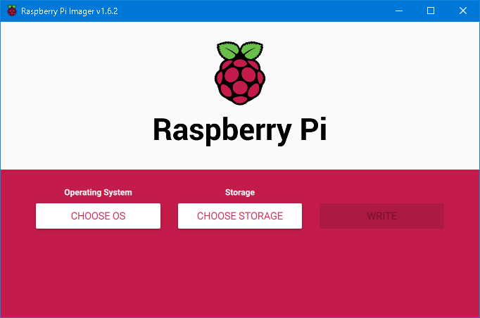

# Linux - はじめに - Raspberry Pi

[Linuxのトップへ](./../index.md)

## Raspberry Piとは

名刺サイズのシングルボードコンピュータ。教育を目的に開発された。

非常に安価であり、電子工作などの用途で使用される。

OSはLinuxを使用し、メジャーなディストリビューションを簡単にインストールできる。

ここではRaspberry PiにRaspbianをインストールし、セキュリティ設定を行った上でインターネットに接続し、他のPCからssh接続して操作できるようにするまでを説明する。

## Raspberry Pi用のOSのインストーラ(Imager)をmicroSDにコピーする

インターネット接続できるWindows 10を使う。

[ここ]からインストーラ(exeファイル)をダウンロードし、実行してImagerをPCにインストールする。

インストールしたらImagerを実行。

このような画面が出たら、インストールするOSと、インストール先のmicroSDカードのドライブを選択する。

OSは、Raspberry Pi OS (other)→Raspberry Pi Lite(32bit)を選択する。

Recommendedの方はデスクトップ機能がついており、それでも問題ないのだが、今回は自動化・サーバ用としてデスクトップ機能のないLiteの方を選択する。

しばらくかかるので、待つ。

終わると、Imagerによって中身が書き換えられたmicroSDがWindowsに認識され、「使用するにはフォーマットが必要です」と出る。無視してmicroSDカードを抜く。

なお、パッケージが壊れるなどでRaspberry Piを完全に初期化したい場合もImagerを使って新しいものを書き直せばよい。

## Raspberry Piの電源を入れる

Raspberry Piにキーボード、マウス、ディスプレイを接続し、Imagerでデータを書き込んだmicroSDカードを挿す。

Raspberry Piは、micro USB(USB-B)で給電すると自動で起動するようになっている（または、スイッチ付きの給電ケーブルを使用する場合、スイッチを入れると起動するようになるので便利）。

